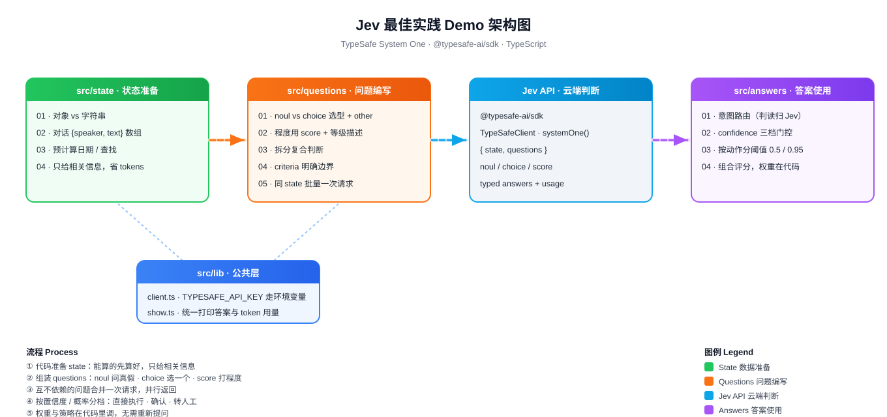

# JevDemo

基于 [TypeSafe](https://docs.typesafe.ai) **Jev**（System One 模型）的 TypeScript 最佳实践 Demo。
13 个可运行场景，覆盖三件事：**怎么准备 state、怎么写 questions、怎么用 answers**。全部调用真实 Jev API。



> 架构图含流动动画，GitHub 上是静态渲染 —— 在浏览器里打开 `jevdemo-architecture.svg` 可看动画。

## 运行

```bash
npm install
npm run scenario -- src/state/01-object-state.ts   # 任一场景同理
```

`.env` 中配置 `TYPESAFE_API_KEY`（在 [typesafe.ai](https://www.typesafe.ai) 获取）。

## 场景一览

### state · 状态准备

| 文件 | 要点 |
|---|---|
| `01-object-state.ts` | 多块相关信息用对象组织，字段名可被问题直接引用；单段文本用 string 即可 |
| `02-transcript-structure.ts` | 对话记录用 `[{speaker, text}]` 数组按顺序保留上下文（谁说的、在回复什么） |
| `03-precompute.ts` | 日期差、身份查找等能算的先在代码里算好，别让 Jev 做计算 |
| `04-relevant-only.ts` | 只给回答当前问题所需的信息 —— 无关信息降低准确率且按 token 计费 |

### questions · 问题编写

| 文件 | 要点 |
|---|---|
| `01-noul-vs-choice.ts` | 需要一个答案用 choice（列表不全就加 `other`）；多标签用独立 noul |
| `02-noul-vs-score.ts` | noul 答"是否"；程度用 score 并具体描述每个等级 |
| `03-split-questions.ts` | 复合判断拆成多个问题，代码组合答案，每个判断可审计 |
| `04-criteria.ts` | criteria 明确边界：noul 定义 true/false，choice 描述选项边界，score 描述等级信号 |
| `05-batch.ts` | 同一 state 且互不依赖的问题合并一次请求（实测 7 请求 2.8s → 1 请求 0.3s） |

### answers · 答案使用

| 文件 | 要点 |
|---|---|
| `01-intent-routing.ts` | Jev 判意图，业务规则（套餐、日期、政策）留在代码里执行 |
| `02-confidence-gating.ts` | choice/score 看 confidence、noul 看概率：直接执行 / 确认 / 转人工三档 |
| `03-thresholds-by-action.ts` | 不同动作不同阈值：建议回复 0.5，自动退款 0.95 |
| `04-composite-scoring.ts` | Jev 出判断，代码加权组合；调权重无需重新调用 |

## 核心要点

- **state**：用对象、结构化、预先计算、只给必要信息
- **questions**：选对类型、拆解判断、明确 criteria、批量提问
- **answers**：意图路由、置信度分档、按动作设阈值、组合评分

## 参考

- [TypeSafe 文档](https://docs.typesafe.ai)
- [JavaScript SDK](https://docs.typesafe.ai/sdk/javascript.md)
